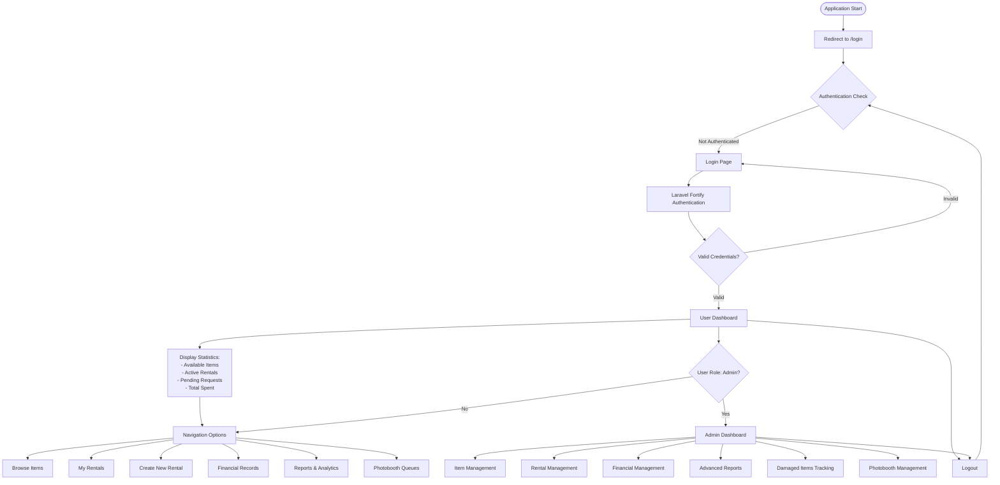
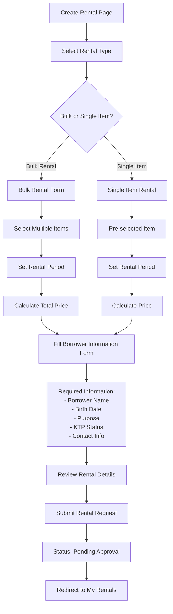
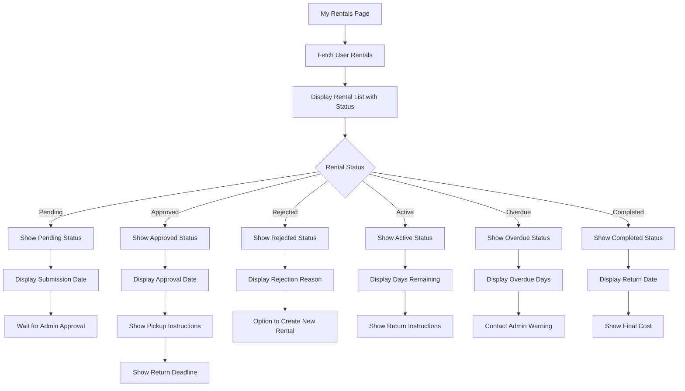
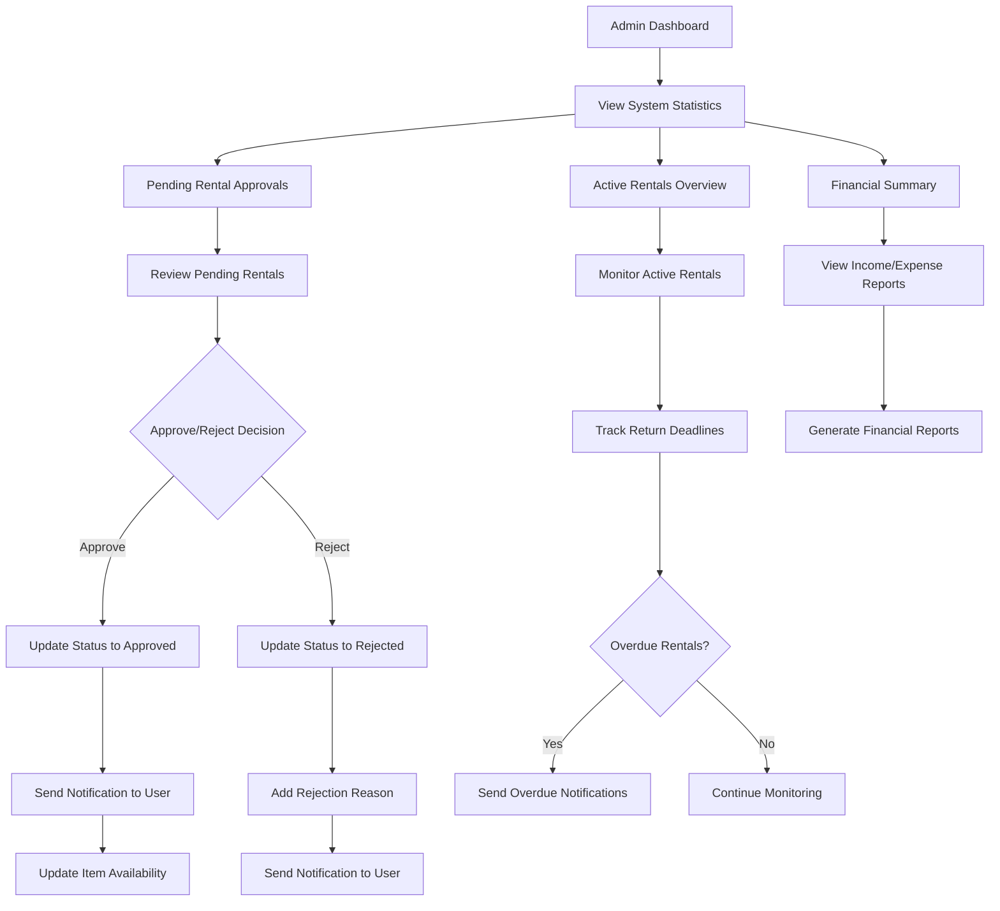

# STEMS (Equipment Rental System) - Detailed Flowchart

## Overview
STEMS is a Laravel-based equipment rental management system that allows users to browse, rent, and manage scientific equipment while providing administrators with comprehensive management tools.

## Main Application Flow



## Item Browsing & Rental Flow

```mermaid
flowchart TD
    A[Browse Items Page] --> B[Display Item Categories]
    B --> C[Show Items Grid with Filters]
    C --> D[Item Status Indicators:
    - Ready (Available)
    - Rented (Unavailable)
    - Maintenance (Unavailable)]

    D --> E[User Clicks Item]
    E --> F[Item Detail View]
    F --> G[Show Item Information:
    - Name & Description
    - Category & Location
    - Condition & Status
    - Price per day
    - Available Quantity]

    G --> H{Check Availability}
    H -->|Available| I[Show "Rent This Item" Button]
    H -->|Not Available| J[Show "Currently Unavailable"]

    I --> K[Add to Rental Selection]
    K --> L[Continue Browsing / Create Rental]

    J --> M[Show Alternative Items]
    M --> C
```

## Rental Creation Process



## Rental Management Flow



## Admin Management Flow



## Data Model Relationships

```mermaid
erDiagram
    User ||--o{ Rental : "has many"
    User {
        id PK
        name string
        email string
        password string
        role string
    }

    Item ||--o{ Rental : "has many"
    Item {
        id PK
        name string
        description text
        category_id FK
        condition enum
        status enum
        location string
        quantity int
        buy_price decimal
        rent_price decimal
    }

    Category ||--o{ Item : "has many"
    Category {
        id PK
        name string
        description text
    }

    Rental ||--o{ FinancialRecord : "has many"
    Rental {
        id PK
        user_id FK
        item_id FK
        start_date date
        end_date date
        total_price decimal
        status enum
        returned_at datetime
        payment_status enum
        borrower_name string
        purpose text
    }

    PhotoboothQueue ||--o{ FinancialRecord : "has many"
    PhotoboothQueue {
        id PK
        user_name string
        status enum
        queue_number int
        created_at datetime
    }

    FinancialRecord {
        id PK
        type enum
        category string
        description text
        amount decimal
        date date
        rental_id FK
        photobooth_queue_id FK
    }
```

## Key Features Summary

### User Features:
- Browse and search equipment by category
- Create rental requests (single or bulk)
- Track rental status and history
- View financial records
- Access reports and analytics
- Manage photobooth queues

### Admin Features:
- Approve/reject rental requests
- Manage equipment inventory
- Track damaged items
- Generate financial reports
- Monitor system usage
- Manage photobooth operations

### Technical Stack:
- **Frontend**: Livewire, TailwindCSS, Flux UI
- **Backend**: Laravel 12, PHP 8.x
- **Database**: PostgreSQL (Neon)
- **Authentication**: Laravel Fortify
- **Caching**: Database sessions, Redis/file cache
- **Asset Management**: Vite, Laravel Vite Plugin