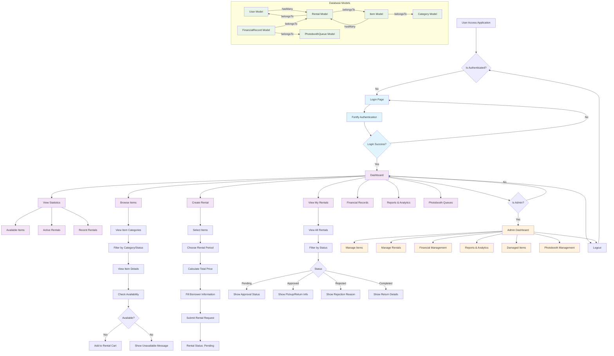

```mermaid
flowchart TD
    %% Start Point
    A[User Access Application] --> B{Is Authenticated?}

    %% Authentication Flow
    B -->|No| C[Login Page]
    C --> D[Fortify Authentication]
    D --> E{Login Success?}
    E -->|No| C
    E -->|Yes| F[Dashboard]

    %% User Dashboard Flow
    F --> G[View Statistics]
    G --> H[Available Items]
    G --> I[Active Rentals]
    G --> J[Recent Rentals]

    %% User Navigation
    F --> K[Browse Items]
    F --> L[Create Rental]
    F --> M[View My Rentals]
    F --> N[Financial Records]
    F --> O[Reports & Analytics]
    F --> P[Photobooth Queues]

    %% Items Management
    K --> Q[View Item Categories]
    Q --> R[Filter by Category/Status]
    R --> S[View Item Details]
    S --> T[Check Availability]
    T --> U{Available?}
    U -->|Yes| V[Add to Rental Cart]
    U -->|No| W[Show Unavailable Message]

    %% Rental Creation Flow
    L --> X[Select Items]
    X --> Y[Choose Rental Period]
    Y --> Z[Calculate Total Price]
    Z --> AA[Fill Borrower Information]
    AA --> BB[Submit Rental Request]
    BB --> CC[Rental Status: Pending]

    %% Rental Management
    M --> DD[View All Rentals]
    DD --> EE[Filter by Status]
    EE --> FF{Status}
    FF -->|Pending| GG[Show Approval Status]
    FF -->|Approved| HH[Show Pickup/Return Info]
    FF -->|Rejected| II[Show Rejection Reason]
    FF -->|Completed| JJ[Show Return Details]

    %% Admin Flow
    F --> KK{Is Admin?}
    KK -->|Yes| LL[Admin Dashboard]
    KK -->|No| F

    %% Admin Features
    LL --> MM[Manage Items]
    LL --> NN[Manage Rentals]
    LL --> OO[Financial Management]
    LL --> PP[Reports & Analytics]
    LL --> QQ[Damaged Items]
    LL --> RR[Photobooth Management]

    %% Data Models
    subgraph "Database Models"
        UU[User Model]
        VV[Item Model]
        WW[Rental Model]
        XX[Category Model]
        YY[FinancialRecord Model]
        ZZ[PhotoboothQueue Model]
    end

    %% Relationships
    UU -->|hasMany| WW
    VV -->|belongsTo| XX
    VV -->|hasMany| WW
    WW -->|belongsTo| UU
    WW -->|belongsTo| VV
    YY -->|belongsTo| WW
    YY -->|belongsTo| ZZ

    %% Logout
    F --> SS[Logout]
    LL --> SS
    SS --> B

    %% Styling
    classDef authClass fill:#e1f5fe
    classDef userClass fill:#f3e5f5
    classDef adminClass fill:#fff3e0
    classDef dataClass fill:#e8f5e8

    class C,D,E authClass
    class F,G,H,I,J,K,L,M,N,O,P userClass
    class LL,MM,NN,OO,PP,QQ,RR adminClass
    class UU,VV,WW,XX,YY,ZZ dataClass
```